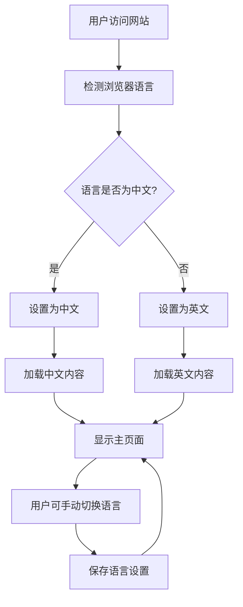

# 个人主页国际化需求文档

## 1. Product Overview

本项目旨在为现有的Vue.js个人主页网站添加国际化功能，支持中英文双语切换，并能根据用户浏览器语言设置自动适配语言。项目将解决当前网站仅支持中文的局限性，为国际用户提供更好的访问体验，扩大网站的受众范围和影响力。

## 2. Core Features

### 2.1 User Roles

由于这是个人主页网站，不需要区分用户角色，所有访问者都享有相同的浏览权限。

### 2.2 Feature Module

国际化功能主要涉及以下页面的改造：

1. **主页面**：Logo区域、个人简介、一言显示、天气信息
2. **功能区**：音乐播放器、时光胶囊、社交链接
3. **设置页面**：壁纸设置、音乐设置、其他配置选项
4. **底部信息**：版权信息、建站统计
5. **系统消息**：错误提示、成功提示、加载状态

### 2.3 Page Details

| Page Name | Module Name | Feature description |
|-----------|-------------|---------------------|
| 主页面 | Logo区域 | 支持中英文站点名称显示，保持视觉一致性 |
| 主页面 | 个人简介 | 提供中英文个人介绍内容，支持动态切换 |
| 主页面 | 一言显示 | 集成中英文一言API，根据语言显示对应内容 |
| 主页面 | 天气信息 | 天气描述、风向等信息的中英文显示 |
| 功能区 | 时光胶囊 | 时间单位（今日、本周、本月、本年）的多语言支持 |
| 功能区 | 音乐播放器 | 播放控制按钮、状态提示的国际化 |
| 功能区 | 社交链接 | 社交平台提示文字的中英文适配 |
| 设置页面 | 语言切换 | 新增语言选择器，支持手动切换中英文 |
| 设置页面 | 壁纸设置 | 设置选项标签和说明的多语言支持 |
| 底部信息 | 版权信息 | 版权声明、建站统计的中英文显示 |
| 系统消息 | 提示信息 | 所有ElMessage提示的国际化处理 |
| 系统消息 | 错误处理 | 网络错误、加载失败等提示的多语言支持 |

## 3. Core Process

### 用户语言体验流程

1. **自动检测**：用户首次访问时，系统检测浏览器语言设置
2. **语言匹配**：根据检测结果自动设置为中文或英文
3. **内容加载**：页面按照设定语言加载对应的文本内容
4. **手动切换**：用户可通过设置页面手动切换语言
5. **状态保存**：语言选择保存到本地存储，下次访问时保持

## 4. User Interface Design

### 4.1 Design Style

- **主色调**：保持现有的深色主题风格，主色为 #efefef（浅色文字）
- **按钮样式**：圆角卡片式设计，支持毛玻璃效果
- **字体设置**：
  - 中文：系统默认字体
  - 英文：Pacifico-Regular（Logo区域），系统Sans-serif（正文）
  - 字号：响应式设计，移动端适配
- **布局风格**：卡片式布局，顶部导航，响应式设计
- **图标样式**：使用@icon-park/vue-next图标库，统一视觉风格

### 4.2 Page Design Overview

| Page Name | Module Name | UI Elements |
|-----------|-------------|-------------|
| 主页面 | 语言切换器 | 位于设置页面，下拉选择框样式，图标+文字形式 |
| 主页面 | Logo区域 | 保持现有圆形头像+文字布局，文字内容支持动态切换 |
| 主页面 | 个人简介 | 卡片式设计，引号装饰，支持多行文本显示 |
| 功能区 | 时光胶囊 | 进度条+百分比显示，时间单位文字国际化 |
| 设置页面 | 语言选项 | 新增设置项，开关式或选择器式交互 |
| 底部信息 | 版权区域 | 保持现有布局，文字内容支持切换 |

### 4.3 Responsiveness

项目采用移动端优先的响应式设计，支持触摸交互优化。语言切换功能在各种屏幕尺寸下都能正常使用，确保国际化功能的完整体验。